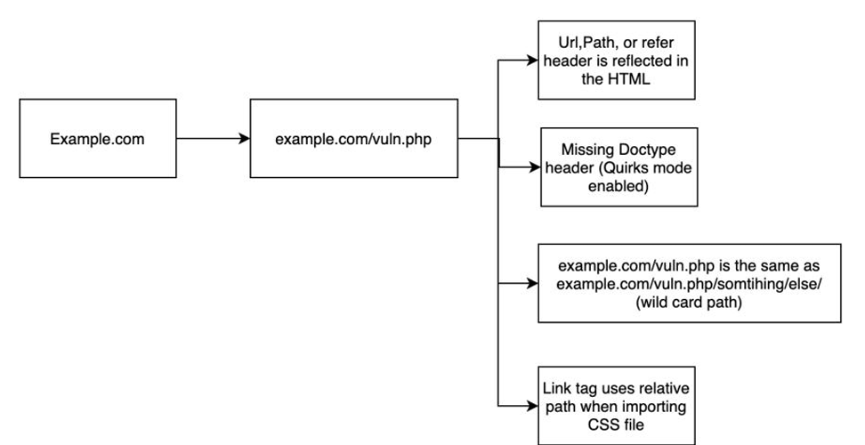

# RPO

### <mark style="color:yellow;">Basic Concepts</mark>

#### Ways an application can load the CSS file

```html
<!-- using the full path to the CSS file  -->
<link   href="http://example.com/style.css"   rel="stylesheet"   type="text/css"/>

<!-- using root dir of the CSS file -->
<link   href="/style.css"   rel="stylesheet"   type="text/css"/>

<!--  using a relative path  -->
<link   href="style.css"   rel="stylesheet"   type="text/css"/>
```

#### Quirks mode

Handles the poorly coded websites.

If quirks mode is enabled the browser will ignore the “content-type” of a file when processing it.

* EX: parsing the HTML file as if it's a CSS file.

### <mark style="color:yellow;">Exploitation RPO</mark>

#### Prerequisites

Meet all the following requirements to exploit RPO.

<figure><figcaption></figcaption></figure>

#### Vulnerable Code Snippet

<figure><figcaption></figcaption></figure>

**Meeting requirements:**



Swap Tabs



The “okay/” path is displayed on the page.

<figure><figcaption></figcaption></figure>



The “document type” tag is missing from the HTML source.





The “/home/okay/” resolves to the same page as “/home”.

<figure><figcaption></figcaption></figure>



When changing the URL to “/home/okay/”, the “Link” tag tries to import its stylesheet from “/home/okay.style.css”

<figure><figcaption></figcaption></figure>



#### After meeting all requirements, try to inject CSS code to turn the font red so we now know the target is vulnerable:

EX: <mark style="color:red;">%0A{}\*{color:red;}///</mark>

<figure><figcaption></figcaption></figure>

### <mark style="color:yellow;">Impact</mark>

Low severity finding.

* XSS, web defacement, and extracting sensitive data.
